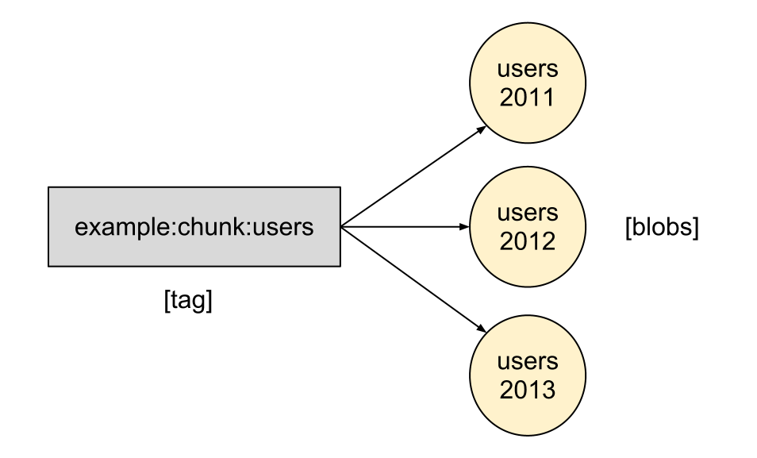
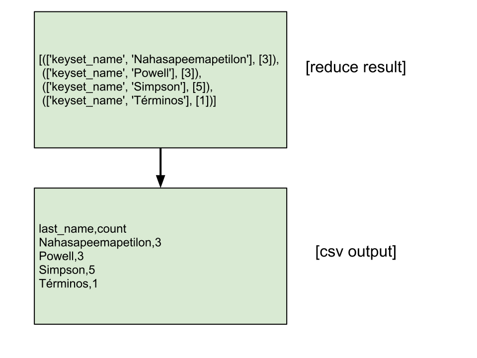

Example 1 - Count Last Names
============================

The canonical map/reduce example: count the occurrences of words in a 
document. In this case, we'll count the occurrences of last names in a data 
file containing a bunch of lines of json.

Input
-----

Here's our input data::

    diana@ubuntu:~$ cat data.txt 
    {"first_name":"Homer", "last_name":"Simpson"}
    {"first_name":"Manjula", "last_name":"Nahasapeemapetilon"}
    {"first_name":"Herbert", "last_name":"Powell"}
    {"first_name":"Ruth", "last_name":"Powell"}
    {"first_name":"Bart", "last_name":"Simpson"}
    {"first_name":"Apu", "last_name":"Nahasapeemapetilon"}
    {"first_name":"Marge", "last_name":"Simpson"}
    {"first_name":"Janey", "last_name":"Powell"}
    {"first_name":"Maggie", "last_name":"Simpson"}
    {"first_name":"Sanjay", "last_name":"Nahasapeemapetilon"}
    {"first_name":"Lisa", "last_name":"Simpson"}
    {"first_name":"Maggie", "last_name":"Términos"}

DDFS
----

The first step is to place this file in 
`Disco's Distributed Filesystem <http://discoproject.org/doc/howto/ddfs.html>`_ (DDFS). 
Once placed in DDFS, this file is referred to by Disco as a **blob**. 
DDFS is a tag-based filesystem. Instead of organizing files into directories, 
you **tag** a collection of blobs with a **tag_name** for lookup later.

I this case, we'll be tagging our data file as **example:chunk:users**.

Make sure `disco <http://discoproject.org/>`_ is running::

    diana@ubuntu:~$ disco start
    Master ubuntu:8989 started

Toss the input data into DDFS::

    diana@ubuntu:~$ ddfs chunk example:chunk:users ./data.txt 
    created: disco://localhost/ddfs/vol0/blob/99/data_txt-0$533-406a9-e50

Verify that the data is in ddfs::

    diana@ubuntu:~$ ddfs xcat example:chunk:users | head -2
    {"first_name":"Homer", "last_name":"Simpson"}
    {"first_name":"Manjula", "last_name":"Nahasapeemapetilon"}

Inferno Rule
------------

For the purpose of this introductory example, think of a map/reduce job as a 
series of four steps, where the output of each step is used as the input to 
the next.

**Input**

**Map**

**Reduce**

**Output**

    Unless you create and specify your own **result_processor**, Inferno 
    defaults to the **keyset_result** processor which simply uses a CSV writer 
    to print the results from the reduce step to standard out.

    Other common ``result_processor`` use cases include: populating a cache, 
    persisting to a database, writing back to 
    `DDFS <http://discoproject.org/doc/howto/ddfs.html>`_ or 
    `DiscoDB <http://discoproject.org/doc/contrib/discodb/discodb.html>`_, etc.

    Example data transition during the **output** step::

Example Rule
------------

The inferno map/reduce rule (inferno/example_rules/names.py)::

    from inferno.lib.rule import chunk_json_keyset_stream
    from inferno.lib.rule import InfernoRule

    def count(parts, params):
        parts['count'] = 1
        yield parts

    RULES = [
        InfernoRule(
            name='last_names_json',
            source_tags=['example:chunk:users'],
            map_input_stream=chunk_json_keyset_stream,
            parts_preprocess=[count],
            key_parts=['last_name'],
            value_parts=['count'],
        ),
    ]

Output
------

Run the last name counting map/reduce job::

    diana@ubuntu:~$ inferno -i names.last_names_json
    2012-03-09 Processing tags: ['example:chunk:users']
    2012-03-09 Started job last_names_json@533:40914:c355f processing 1 blobs
    2012-03-09 Done waiting for job last_names_json@533:40914:c355f
    2012-03-09 Finished job job last_names_json@533:40914:c355f

The output::

    last_name,count
    Nahasapeemapetilon,3
    Powell,3
    Simpson,5
    Términos,1
