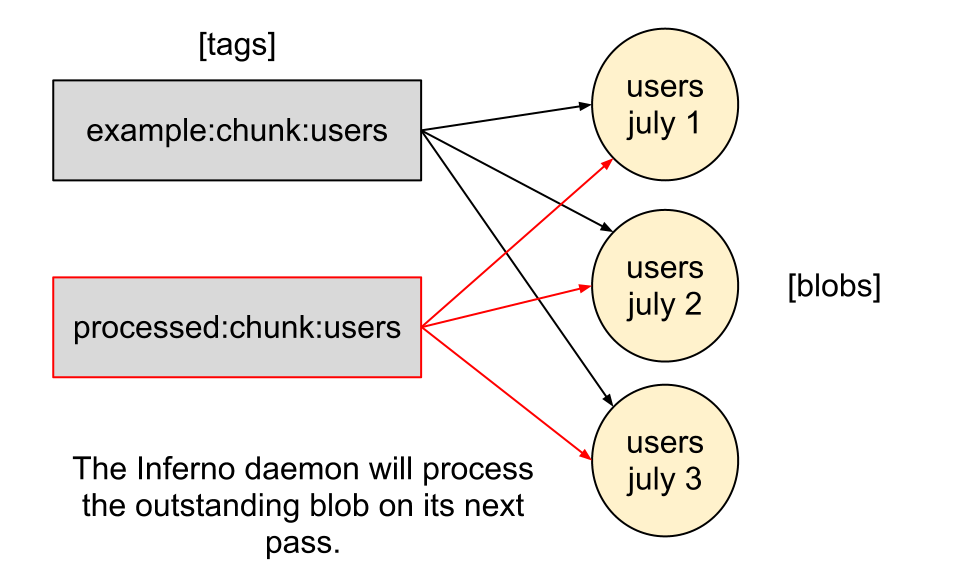

Inferno Daemon
==============

Immediate Mode
--------------

Up until now, the examples have all used Inferno's **immediate mode** 
(-i option). That is, they execute exactly one map/reduce job and then exit.

::

    diana@ubuntu:~$ inferno -i names.last_names_json
    last,count
    Nahasapeemapetilon,3
    Powell,3
    Simpson,5
    Términos,1

Daemon Mode
-----------

You can also run Inferno in **daemon mode**. The Inferno daemon will 
continuously monitor the blobs in DDFS and launch new map/reduce jobs to 
process the incoming blobs as the minimum blobs counts are met.

.. image:: step1.png
   :height: 400px
   :width: 800px
   :align: center
   :scale: 75 %
   :alt: two unprocessed blobs

---------

.. image:: step2.png
   :height: 400px
   :width: 800px
   :align: center
   :scale: 75 %
   :alt: three unprocessed blobs

---------

.. image:: step3.png
   :height: 400px
   :width: 800px
   :align: center
   :scale: 75 %
   :alt: 2 processed blobs, 1 unprocessed blob

---------

Example Daemon Logs
-------------------

Here's the Inferno daemon in action. Notice that it skips the first 
**automatic rule** because the minimum blob count wasn't met. The next 
automatic rules's blob count was met, so the Inferno daemon processes those 
blobs and then persists the results to a data warehouse.

::

    diana@ubuntu:~$ sudo start inferno
    2012-03-27 31664 [inferno.lib.daemon] Starting Inferno...

    ...

    2012-03-27 31694 [inferno.lib.job] Processing tags:['incoming:server01:chunk:task']
    2012-03-27 31694 [inferno.lib.job] Skipping job task_stats_daily: 8 blobs required, have only 0

    ...

    2012-03-27 31739 [inferno.lib.job] Processing tags:['incoming:server01:chunk:user']
    2012-03-27 31739 [inferno.lib.job] Started job user_stats@534:d6c58:d5dcb processing 1209 blobs
    2012-03-27 31739 [inferno.lib.job] Done waiting for job user_stats@534:d6c58:d5dcb
    2012-03-27 31739 [rules.core.database] user_stats@534:d6c58:d5dcb: Saving user_stats_daily data in /tmp/_defaultdESAa7
    2012-03-27 31739 [rules.core.database] user_stats@534:d6c58:d5dcb: Finished processing 240811902 lines in 5 keysets.
    2012-03-27 31739 [inferno.lib.archiver] Archived 1209 blobs to processed:server01:chunk:user_stats:2012-03-27
 